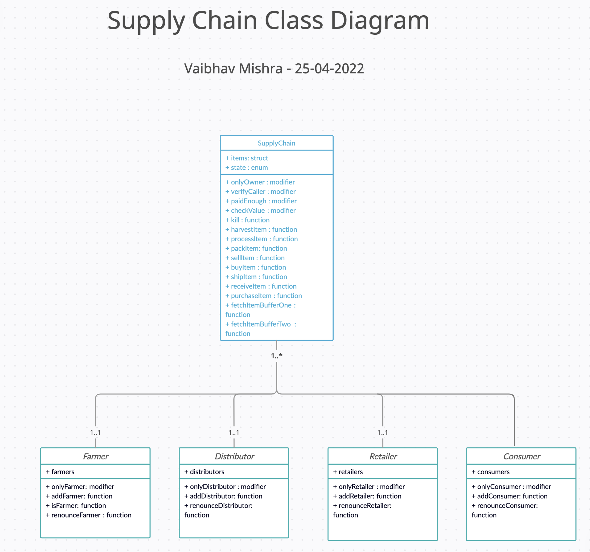

# Ethereum Dapp for Tracking Items through Supply Chain


## Summary
The purpose of this project is to learn web service architecture and web application implementations using Blockchain.  In this project, I have created a coffee supply chain solution on Ethereum using smart contracts with role and access  to track and verify a product's authenticity.  The code for this project is in the `coffee-supply-chain/` folder.


### UML Diagrams
I have created UML activity, sequence, and state diagrams which are included below.

#### Activity Diagram


#### Sequence Diagram


#### State Diagram


#### Classes (Data Model)


### Libraries Write-up
Below are the dependencies in my `packages.json` file:
```json
"dependencies": {
    "truffle": "^5.1.51",
    "truffle-assertions": "^0.9.2",
    "truffle-hdwallet-provider": "^1.0.17",
    "web3": "^1.3.0"
  }
```


Node version used is v12.22.6

### Library Usage:
- `truffle`: truffle is a development framework for Ethereum that makes it easy to compile, test, and migrate solidity contracts to Ethereum networks.I used `truffle` to deploy my smart contracts to the `Rinkeby` test network.
- `truffle-assertions`: the assertions library for truffle has convenience functions designed for solidity assertions inside of truffle tests.  I used the assertion syntax to test whether my contracts correctly emitted different events as expected.
- `truffle-hdwallet-provider`: this library was used to enable  truffle deployments to spend test coins from my Metamask wallet on the Rinkeby network as part of deploying my contracts to `Rinkeby`


The Rinkeby contract address for this project is: `0xa2033443417Dd94D7dc2BEffeaD213F270558D1C`